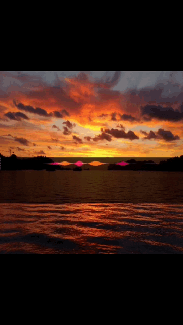

# SwiftVideoCreator

[](https://travis-ci.org/Lexie Kemp/SwiftVideoCreator)
[](https://cocoapods.org/pods/SwiftVideoCreator)
[](https://cocoapods.org/pods/SwiftVideoCreator)
[](https://cocoapods.org/pods/SwiftVideoCreator)

## Example

To run the example project, clone the repo, and run `pod install` from the Example directory first.



## Requirements

Swift 5.0

## Installation

SwiftVideoCreator is available through [CocoaPods](https://cocoapods.org). You will need to have cocoapods installed. To install
SwiftVideoCreator, add the following line to your Podfile:


```ruby
platform :ios, '10.0'
use_frameworks!
target '<Your Target Name>' do
pod 'SwiftVideoCreator'
end
```
Next, run pod install from the command line in your project directory.

## Usage
Import the pod

```ruby
import SwiftVideoCreator
```
Get your video URL, audio URL, and image as a CGImage.
Example if video and audio are stored as files in project and image is stored in assets:

```ruby
guard let videoPath = Bundle.main.path(forResource: "myVideo", ofType:"mov") else {
    print("myVideo.mov not found")
    return
}
let videoUrl = URL(fileURLWithPath: videoPath)

guard let audioPath = Bundle.main.path(forResource: "myAudio", ofType:"mp3") else {
    print("myAudio.mp3 not found")
    return
}
let audioUrl = URL(fileURLWithPath: audioPath)

guard let backgroundImage = UIImage(named: "myBackgroundImage") else {
    print("Background Image not found in Assets")
    return
}
guard let cgBackgroundImage = backgroundImage.cgImage else {
    print("could not convert background image to cgImage")
    return
}
```
Call the createVideo function which will saved your composed video to the documents directory and return the URL
Composition size is the dimensions of the saved video composition
Video size is the dimensions of the video that is on top of the image
Origin is the bottom left corner

```ruby
SwiftVideoCreator.current.createVideo(
fileName: "exampleVideo", 
compositionSize: CGSize(width: 360, height: 360), 
videoUrl: waveUrl, 
videoSize: CGSize(width: 360, height: 90), 
videoOrigin: CGPoint(x: 0, y: 100), 
videoOpacity: 0.7, 
audioUrl: audioUrl, 
image: cgBackgroundImage, 
imageOrigin: CGPoint(x: 0, y: 0), 
imageSize: CGSize(width: 360, height: 360), 
imageOpacity: 1.0,
success: { url in
    print(url)
}, 
failure: { error in
    print("video creation failed with error \(error)")
})
```
If you want to open the video in a video player, use the following function

```ruby
func playVideo(videoUrl: URL) {
    let player = AVPlayer(url: videoUrl)
    let playerVC = AVPlayerViewController()
    playerVC.player = player
    present(playerVC, animated: true) {
        player.play()
    }
}
```

## Author

Lexie Kemp, lexie.kd@gmail.com

## License

SwiftVideoCreator is available under the MIT license. See the LICENSE file for more info.
